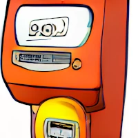
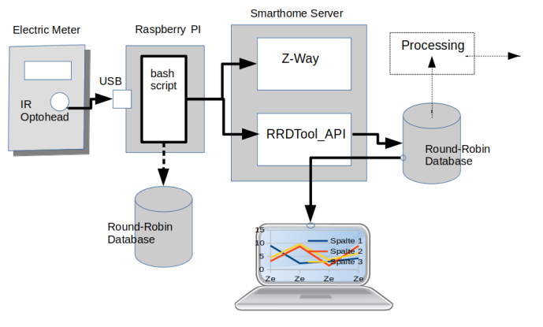
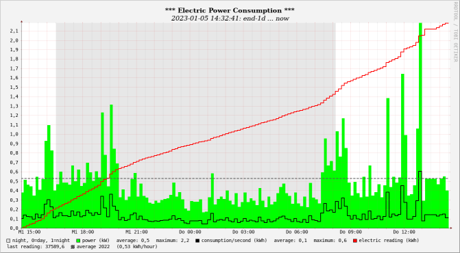

<!-- use sgmlproc for generating a html file -->

# read_LOGAREX

is a sample script, a Linux bash script that shows how to easily read data 
from an electric meter via an infrared interface and send it to a round-robin 
database and/or a Z-Way virtual device.

This example is made for the special meter LOGAREX LK13BD102015. It should be possible to adapt 
the script to many other meters without much effort.

This script
- either stores data into a local round-robin database using RRDtool-commands.
- or stores data into a remote round-robin database using RRDTool_API.
- and forwards data to a Z-Way virtual device using Curl.

RRDtool is not only a database software, it also provides a graphing function. It could look like this:

## Requirements

An electric meter with an infrared interface using the standard IEC 62056-21 with printable output for data exchange, a USB infrared optohead cable, 
and a Linux system with bash.
No other software is needed to read the meter.

## Installation

* Prepare the electric meter for data transmission.
* Connect the meter via an optohead cable with a USB port of your system.
* Find the used Linux device name (for example with **ls /dev/ttyUSB\***).
* Add a udev rule for this serial infrared device (see below). This rule creates a 
descriptive name for the serial interface, independently of the currently used 
physical USB port, and adds the necessary rights for the user.
* Put the packet on any place of your choice. 
* Adapt the script **read_LOGAREX.bash** and may be **store_zway.bash** to your needs.
* Adjust the settings in the **./settings** file to your requirements.
* Run the script **00_install_read_LOGAREX.bash**
* Start the **read_LOGAREX.bash** script.

#### UDEV Rule

As root add a new line to file **/etc/udev/rules.d/99-usb-serial.rules**:
 
**SUBSYSTEM=="tty", ATTRS{idVendor}=="VVV", ATTRS{idProduct}=="PPP", 
ATTRS{serial}=="SSS", SYMLINK+="LLL", OWNER="OOO"**
 with: 
 VVV = vendor id
 PPP = product id
 SSS = serial number
 LLL = new device link /dev/LLL to create
 OOO = owner (= $USER)
 and run 
 **sudo udevadm control --reload-rules**
 **sudo udevadm trigger**
 **ls -l /dev/LLL** to take the change into effect.
  
These data can be found with the commands:
 **udevadm info -a -n /dev/ttyUSB\<n>| grep '{idVendor}' | head -n1**
 **udevadm info -a -n /dev/ttyUSB\<n> | grep '{idProduct}' | head -n1**
 **udevadm info -a -n /dev/ttyUSB\<n> | grep '{serial}' | head -n1**
 with  /dev/ttyUSB\<n> = your currently used USB port.

## Settings

Important settings (file **./settings**):
* the logical name of the meter device
* data for the rrd database access

## Start - Stop the Script read_LOGAREX.bash

To get the commands run the script **11_get_procid.bash**.

## Uninstallation

* Stop the script **read_LOGAREX.bash**.
* Remove the udev rule.
* Run the script **99_do_removes.bash**.
* Delete the packet folder.

## License: MIT

Copyright © 2022 piet66

Permission is hereby granted, free of charge, to any person obtaining a copy 
of this software and associated documentation files (the "Software"), to deal 
in the Software without restriction, including without limitation the rights 
to use, copy, modify, merge, publish, distribute, sublicense, and/or sell 
copies of the Software, and to permit persons to whom the Software is furnished 
to do so, subject to the following conditions:

The above copyright notice and this permission notice shall be included in all 
copies or substantial portions of the Software.

THE SOFTWARE IS PROVIDED "AS IS", WITHOUT WARRANTY OF ANY KIND, EXPRESS OR 
IMPLIED, INCLUDING BUT NOT LIMITED TO THE WARRANTIES OF MERCHANTABILITY, 
FITNESS FOR A PARTICULAR PURPOSE AND NONINFRINGEMENT. IN NO EVENT SHALL 
THE AUTHORS OR COPYRIGHT HOLDERS BE LIABLE FOR ANY CLAIM, DAMAGES OR OTHER 
LIABILITY, WHETHER IN AN ACTION OF CONTRACT, TORT OR OTHERWISE, ARISING FROM, 
OUT OF OR IN CONNECTION WITH THE SOFTWARE OR THE USE OR OTHER DEALINGS IN THE 
SOFTWARE.

